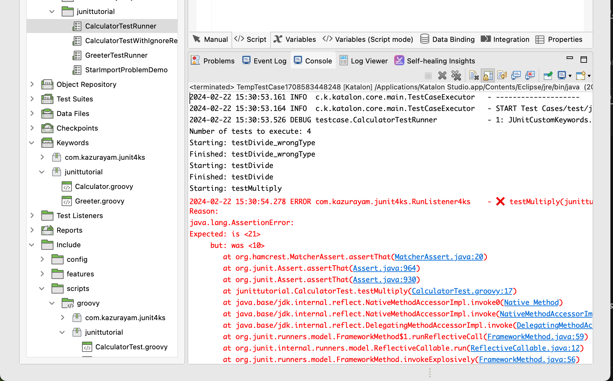

Running JUnit in Katalon Studio
====

by kazurayam
- 1st release at 18 July 2018
- 2nd release at 13 January 2019

## What is this?

This is a simple [Katalon Studio](https://www.katalon.com/) project for demonstration purpose. You can download the zip file from [Releases](https://github.com/kazurayam/RunningJUnitInKatalonStudio/releases) page, unzip it, open it with your Katalon Studio.

The first version was developed in April 2018 using Katalong Studio version 5.4.2, and later rewritten in January 2019 using version 5.10.1.

This demo will show you how to run JUnit4-based unit tests to verify your Custom Keywords within Katalon Studio.

The 2nd release provides a new Custom Keyword class [`com.kazurayam.ksbackyard.junit.JUnitCustomKeywords`](Keywords/com/kazurayam/ksbackyard/junit/JUnitCustomKeywords.groovy) with a method `runWithJUnitRunner`. Your Test Case can call this method as a usual custom keyword and execute your JUnit-based tests within Katalon Studio.

## Background

### Problem to solve
I wanted to develop a set of Custom Keywords in a Katalon Studio project. See a post in the Katalon Forum: [Taking entire page screenshot using AShot in Katalon Studio](https://forum.katalon.com/t/taking-entire-page-screenshot-using-ashot-in-katalon-studio/12429) for the background story. My custom keywords were expected to be large and complexed, therefore bug-prone. I wanted to execute thorough unit-testing on my Groovy classes using [JUnit4](https://junit.org/junit4/) framework.

### JUnit4 was bundled in Katalon Studio

One day in April 2018 I created a test case of single line:
```
import org.junit.runner.JUnitCore
```

This worked! The import statement succeeded. No error was emitted. I realized that the JUnit classes are available in the Katalon Studio's Java VM. Later I found that the Katalon Studio's distribution contains `plugins/org.junit_4.12.0.jar`.

### My first attempt

OK, all I need to know is where to locate test classes, how to activate the runner, and how to report the result. I have done an experiment. I believe I have got a success. Tag [0.2](https://github.com/kazurayam/RunningJUnitInKatalonStudio/tree/0.2) of this repository contains this version of my attempt. This version was created at April 2018.

The first attempt worked, but I thought the method was too lenghthy and complicated. I wanted to find out an easier one.

### My second attempt

Dec 2018, devalex88 (Katalon Developer) proposed a new approach at https://forum.katalon.com/t/how-to-write-katalon-studio-tests-with-intellij-idea-and-other-ides/15940 .

The idea includes:
1. Since version 5.7.0, `.classpath` file in a Katalon Studio project contains a line `<classpathentry kind="src" output="bin/groovy" path="Include/scripts/groovy"/>`. This line defines a build path acknowledged Katalon Studio(=Eclipse). All of `*.groovy` files located in this folder will be compiled (when saved) by the Groovy compiler in Katalon Studio.
2. It is OK for us to locate `*Test.groovy` files for unit-testing in the `Include/scripts/groovy` folder.
3. We can use Eclipse to run JUnit. We can open a katalon project with Eclipse (not Katalon Studio)! The built-in feature of Eclipse will look after activating the JUnit tests and reporting the results.

However I gave up this approach, because I could not test my custom keyword, within Eclipse, which interacts with web sites via WebDriver. See [this post](https://forum.katalon.com/t/how-to-write-katalon-studio-tests-with-intellij-idea-and-other-ides/15940/27) for detail.

### My third attempt

In December 2018, I thought that I could test my Custom Keywords using the BDD feature with Cucumber in Katalon Studio. I learned the following manual pages.
- [Cucumber Features file](https://docs.katalon.com/katalon-studio/docs/cucumber-features-file.html)
- [Step Definitions](https://docs.katalon.com/katalon-studio/docs/step-definitions.html)
- [Running Cucumber Features file](https://docs.katalon.com/katalon-studio/docs/running-cucumber-features-file.html)

It seemed OK. I could nearly achieve what I wanted to do. But unfortunately I was blocked by a defect in Katalon Studio:
- [The Cucumber version bundled in Katalon Studio 5.10.1 is old, therefore sometimes throws exception](https://forum.katalon.com/t/poor-error-diagnostics-when-cucumber-feature-is-problematic/17474/8)

I could not rely on Cucumber in Katalon Studio.

### My fourth attempt

In January 2019 I read the source of [`com.kms.katalon.core.cucumber.keyword.CucumberBuiltinKeywords`](https://github.com/katalon-studio/katalon-studio-testing-framework/blob/master/Include/scripts/groovy/com/kms/katalon/core/cucumber/keyword/CucumberBuiltinKeywords.groovy) on GitHub. `CucumberBuiltinKeywords` is the core part of Cucumber-Katalon integration. I studied it to find that **I could mimic that to implement JUnit-Katalon integration**. So I made a new custom keyword class  [`com.kazurayam.ksbackyard.junit.JUnitCustomKeywords`](Keywords/com/kazurayam/ksbackyard/junit/JUnitCustomKeywords.groovy). This looks working fine.

A long and winding road it was. I believe I have found out a satisfactory method to test my custom keywords with JUnit4 within Katalon Studio. I publish it as the 2nd release of [my demo project](https://github.com/kazurayam/RunningJUnitInKatalonStudio/).

## Description of the demo (2nd release)

### Prerequisites

1. Use Katalon Studio version 5.7.0 or higher. I used v5.10.1.
2. Download the zip file of this project tagged with 1.0 at [Releases](https://github.com/kazurayam/RunningJUnitInKatalonStudio/releases) page and unzip it.

### Custom Keywords to test

I have made some custom keyword classes. I want to test them using JUnit4:
- [`junittutorial.Calculator`](Keywords/junittutorial/Calculator.groovy) --- calculator which add/subtract/multiply/divide 2 integers
- [`junittutorial.Greeter`](Keywords/junittutorial/Greeter.groovy) --- this will say hello to someone you sepecified
- [`com.example.MiniScreenshotDriver`](Keywords/com/example/MiniScreenshotDriver.groovy) --- taks entire-page screenshot of a URL and save PNG into file

### Test Cases

I made a few Test Cases in the ordinary `<projectDir>/Test Cases` folder. These test cases run JUnit4 in Katalon Studio.
- [`CalculatorTest`](Scripts/test/CalculatorTestRunner/Script1547192368406.groovy)
- [`GreeterTestRunner`](Scripts/test/GreeterTestRunner/Script1547296768493.groovy)
- [`AllJunittutorialTestsRunner`](Scripts/test/AllJunittutorialTestsRunner/Script1547339195032.groovy)
- [`MiniScreenshotDriverTestRunner`](Scripts/test/MiniScreenshotDriverTestRunner/Script1547301583006.groovy)

For example, MiniScreenshotDriverTestRunner looks like this:
```
import com.example.MiniScreenshotDriverTest

CustomKeywords.'com.kazurayam.ksbackyard.junit.JUnitCustomKeywords.runWithJUnitRunner'(MiniScreenshotDriverTest.class)
```

### How to run tests

You can run these test cases just as usual Katalon Studio test case.


When it finished, you can see the test result output in the Log Viewer and Console in Katalon Studio GUI.


### My JUnit-based tests

I made a few JUnit-based tests. I located them in the `<projectDir>/Include/scripts/groovy` folder.
- [`junittutorial/CalculatorTest.groovy`](Include/scripts/groovy/junittutorial/CalculatorTest.groovy)
- [`junittutorial/GreeterTest.groovy`](Include/scripts/groovy/junittutorial/GreeterTest.groovy)
- [`com/example/MiniScreenshotDriverTest.groovy`](com/example/Include/scripts/groovy/com/example/MiniScreenshotDriverTest.groovy)

These test classes should be coded just as usual JUnit4 tests. For example, `junittutorial.GreeterTest` looks like this:

```
package junittutorial

import static org.hamcrest.CoreMatchers.*
import static org.junit.Assert.*

import org.junit.Test
import org.junit.runner.RunWith
import org.junit.runners.JUnit4

@RunWith(JUnit4.class)
class GreeterTest {

    @Test
    void testGreet() {
        String expected = "Hello, world"
        String actual = Greeter.greet("world")
        assertThat(actual, is(expected))
    }
}
```

It's a plain old JUnit test.

### Custom Keyword `runWithJUnitRunner` integrates JUnit with Katalon Studio

`runWithJUnitRunner` keyword enables you to run your tests with JUnit4 in Katalon Studio. See the following source code:
- [`com.kazurayam.ksbackyard.junit.JUnitCustomKeywords`](Keywords/com/kazurayam/ksbackyard/junit/JUnitCustomKeywords.groovy)

I developed this as a mimic of the  [`com.kms.katalon.core.cucumber.keyword.CucumberBuiltinKeywords`](https://github.com/katalon-studio/katalon-studio-testing-framework/blob/master/Include/scripts/groovy/com/kms/katalon/core/cucumber/keyword/CucumberBuiltinKeywords.groovy) class.

## How to apply this method to your projects

In your Katalon Studio project, do the following:
1. make a file `Keywords/com/kazurayam/ksbackyard/junit/JUnitCustomKeywords.groovy`
2. Into it, copy and paste the code [`com.kazurayam.ksbackyard.junit.JUnitCustomKeywords`](Keywords/com/kazurayam/ksbackyard/junit/JUnitCustomKeywords.groovy), save it.
3. make your JUnit test in `Include/scripts/groovy` folder. It would be something like [`Include/scripts/groovy/junittutorial/CalculatorTest.groovy`](Include/scripts/groovy/junittutorial/CalculatorTest.groovy)
4. make your Katalon Studio Testcase in `Test Cases` folder. It would be something like [`Test Cases/AllJunittutorialTestsRunner`](Scripts/test/AllJunittutorialTestsRunner/Script1547339195032.groovy)
5. run your Katalon Studio Testcase by clicking `Run` button in Katalon Studio.
